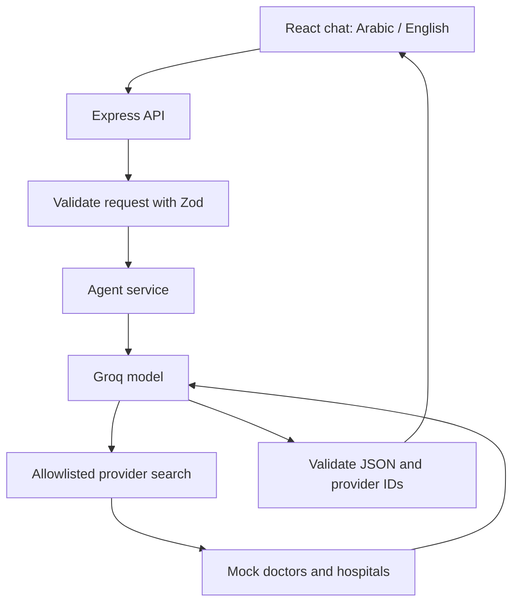

# HealTrip AI Patient Decision Assistant

A bilingual full-stack prototype demonstrating a patient conversation,
clarifying questions, suggested next steps, and tool-based provider search.

This is a technical demonstration, not a clinically validated medical product.
All doctors and hospitals are fictional. Use fictional patient information only.

## Stack

- Frontend: React, TypeScript, Vite
- Backend: Node.js, Express, TypeScript
- AI: Groq API with `openai/gpt-oss-120b`
- Validation: Zod
- Data: in-memory mock records
- Security middleware: Helmet and express-rate-limit

## Architecture



The model proposes tool calls. Application code validates their arguments,
executes the supported function, and sends the results back to the model.

Provider cards are constructed from database records, not generated by the model.

## Project Structure

- `frontend/src/App.tsx`: chat interface, language selection, request handling
- `frontend/vite.config.ts`: development API proxy
- `backend/src/index.ts`: routes, middleware, HTTP error handling
- `backend/src/chat.schema.ts`: request and conversation-history validation
- `backend/src/ai/groq.client.ts`: server-side AI client
- `backend/src/ai/patient-assistant.prompt.ts`: assistant instructions
- `backend/src/ai/provider.tool.ts`: provider-search tool definition
- `backend/src/ai/patient-assistant.service.ts`: bounded agent/tool loop
- `backend/src/ai/patient-assistant.output.ts`: response validation
- `backend/src/tools/search-providers.ts`: validated database search
- `backend/src/data/providers.ts`: fictional records
- `backend/src/data/provider.types.ts`: data types

## Data Structure

The prototype uses two hospitals and four doctors.

### Hospital

| Field | Meaning |
| --- | --- |
| `id` | Unique hospital identifier |
| `name.ar`, `name.en` | Localized display names |
| `city.ar`, `city.en` | Localized city names |
| `cityCode` | Stable search code: riyadh or jeddah |
| `hasEmergencyDepartment` | Mock facility attribute |
| `isMock` | Always true |

### Doctor

| Field | Meaning |
| --- | --- |
| `id` | Unique doctor identifier |
| `name.ar`, `name.en` | Localized display names |
| `specialty` | Cardiology, internal medicine, or family medicine |
| `hospitalId` | Reference to a hospital record |
| `languages` | Arabic and/or English |
| `offersSecondOpinion` | Whether the service is offered |
| `isMock` | Always true |

A hospital can have multiple doctors. The search function joins records using
`hospitalId` and throws if the referenced hospital is missing.

The dataset does not contain appointment schedules, fees, ratings, or addresses.
Offering a service does not imply an appointment is currently available.

## API

### GET /api/health

Checks that the HTTP application is running.
It does not check AI-provider connectivity.

```json
{
  "status": "ok",
  "service": "HealTrip API"
}
```

### POST /api/chat

```json
{
  "message": "I want a routine second opinion from a cardiologist in Riyadh who speaks Arabic.",
  "language": "en",
  "history": []
}
```

`history` accepts up to 12 user/assistant messages with `role` and `content`.
The latest message is supplied separately. System messages are not accepted.

The response includes:

- `reply`: explanation and follow-up questions
- `nextStep`: clarify, emergency, consultation, second_opinion, or no_match
- `questions`: follow-up questions
- `providers`: verified mock doctor/hospital records
- `toolTrace`: executed tool names and result counts
- `isDemo`: true

### Errors

| HTTP status | Error code | Meaning |
| --- | --- | --- |
| 400 | INVALID_INPUT | Request failed schema validation |
| 400 | INVALID_JSON | Malformed JSON body |
| 413 | REQUEST_TOO_LARGE | Body exceeds 128 KB |
| 429 | CHAT_RATE_LIMITED | Application request limit reached |
| 429 | AI_RATE_LIMITED | AI provider returned a rate-limit error |
| 502 | AI_REQUEST_FAILED | AI processing or output validation failed |
| 500 | INTERNAL_ERROR | Unexpected unhandled server error |

## Agent and Tool Design

The system prompt defines language, scope, clarification behavior, emergency
prioritization, tool use, and grounding constraints.

The only executable tool is `search_providers`.

Supported filters:

- Required specialty
- Optional city
- Optional doctor language
- Optional second-opinion requirement

The backend:

1. Validates the incoming request.
2. Sends system instructions and recent conversation context to Groq.
3. Checks requested tool names against an allowlist.
4. Parses tool arguments and validates them using Zod.
5. Executes the search against stored records.
6. Sends results back using the matching tool-call ID.
7. Parses and validates the final JSON decision.
8. Resolves selected doctor IDs against the latest search results.
9. Returns generated guidance and verified provider cards.

Each chat turn allows at most three model requests and two tool calls.
The Groq client has a 20-second timeout per request and no automatic retries.

## Preventing Invented Provider Records

- Provider search returns only stored records.
- Empty searches remain empty.
- The model selects doctor IDs rather than generating provider cards.
- IDs must belong to the latest actual tool results.
- Unknown or duplicate IDs cause the response to be rejected.
- Emergency, clarification, and no-match decisions cannot include provider cards.
- A no-match decision requires an actual search with zero results.
- The prompt forbids appointment-availability claims and provider details in prose.

These controls protect provider cards. They do not prove that every generated
sentence is factual or that a medical decision is correct.

## Security and Privacy

- API keys remain in the backend environment.
- `.env` files are excluded from Git; `.env.example` contains no secret.
- Request bodies are limited to 128 KB.
- Message lengths, history lengths, and supported values are validated.
- Chat requests are limited to five per minute per IP.
- Helmet adds security-related HTTP headers.
- Model text is rendered as plain text, not raw HTML.
- Errors returned to users do not expose provider internals.
- Patient messages are not intentionally logged by application code.

Conversation history is held in browser memory and sent to the AI provider.
The application has no conversation database. Refreshing the page clears history.

This does not imply that the AI provider stores no data. Provider data-handling
terms must be reviewed before processing real patient information.

## Local Setup

Tested locally with Node.js 24 on Windows PowerShell.

### Backend

```powershell
cd backend
npm.cmd ci
Copy-Item .env.example .env
```

Set `GROQ_API_KEY` in `.env`, then:

```powershell
npm.cmd run dev
```

Backend: `http://127.0.0.1:3001`

### Frontend

In another terminal:

```powershell
cd frontend
npm.cmd ci
npm.cmd run dev
```

Frontend: `http://localhost:5173`

Vite forwards `/api` requests to the backend during development.

### Checks and Build

Backend:

```powershell
npm.cmd run typecheck
npm.cmd run build
npm.cmd start
```

Frontend:

```powershell
npm.cmd run build
npm.cmd run lint
```

`start` runs compiled backend files. Rebuild and restart after source changes.
For active development, use `dev`.

On environments without the PowerShell script restriction, `npm` can be used
instead of `npm.cmd`.

## Automated Provider-Grounding Tests

Run from `backend`:

```powershell
npm.cmd test
```

Six tests cover:

- Accepting a doctor returned by the current search
- Rejecting an invented doctor ID
- Rejecting an existing doctor outside the current search results
- Rejecting duplicate IDs
- Accepting an empty selection with empty results
- Rejecting a selected doctor when no search records are available

These tests exercise the same provider-resolution function used by the agent.
They validate provider grounding, not medical correctness.

## Manual Validation

Observed during local testing:

- Health endpoint responds.
- Valid chat input is accepted; empty input is rejected.
- Malformed JSON and oversized bodies are rejected.
- The application rate limit blocks the sixth request in a one-minute window.
- Provider search returns the expected Riyadh cardiologist.
- Arabic UI, Arabic responses, and RTL layout work.
- Clarifying questions ask for city and preferred doctor language.
- A follow-up answer uses the previous conversation context.
- A Jeddah search with incompatible filters returns no_match without a card.
- The supplied chest-pain example returned emergency without provider search.
- AI quota failures display a message and restore the user's draft.
- Frontend build/lint and backend type checks pass.

These are observed examples, not a comprehensive clinical or reliability evaluation.

## Technical Decisions

- Express keeps the prototype small and makes the data flow visible.
- TypeScript provides development-time checking; Zod validates runtime input.
- Mock records keep the task focused on agent integration and grounding.
- Explicit local tool execution keeps database access under backend control.
- Groq was selected after Gemini's free daily quota blocked further testing.
- The interface prioritizes functionality over extensive visual design.
- The response language is separate from the preferred doctor's language.

## Limitations and Next Steps

- No diagnosis, clinical validation, booking, authentication, or real providers.
- Urgency classification depends on the model and prompt; there is no independent,
  clinically validated triage engine.
- Conversation history is client-supplied and untrusted.
- Final JSON is requested through instructions and validated after generation;
  malformed output is rejected rather than repaired automatically.
- The in-memory rate limiter resets on restart and is not shared across servers.
- Free-tier AI quotas can interrupt demonstrations.
- Browser timeout does not guarantee cancellation of backend model processing.
- Provider grounding has six automated tests. Live conversation scenarios were
  tested manually; broader automated regression tests remain.
- Production deployment requires HTTPS, correct API routing, and a carefully
  configured proxy trust boundary.
- A future PostgreSQL implementation would use a hospital foreign key,
  data-integrity constraints, and a repository layer.
- A real medical deployment requires clinical oversight, privacy review,
  stronger abuse controls, and a broader safety evaluation.